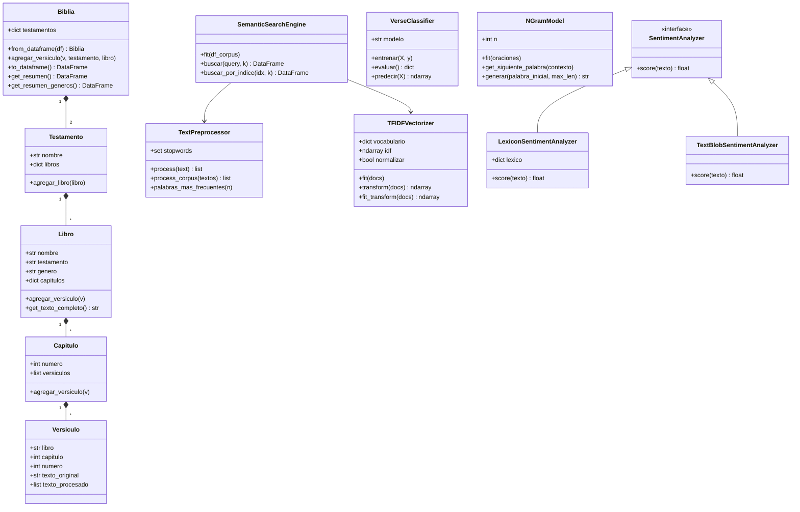

<h1 align="center">Biblical Text Mining</h1>
<h3 align="center">Taller 02 · Programación Científica</h3>

<p align="center">
<a href="https://www.ucn.cl"></a>
<a href="https://eic.ucn.cl"></a>


</p>

> Análisis computacional del corpus bíblico (versión ASV) con técnicas de minería de
> texto, donde **el TF-IDF y la similitud del coseno están implementados a mano**, sin
> recurrir a librerías que los resuelvan. El sistema mide qué tan parecidos son los
> libros entre sí, busca versículos por significado, los clasifica, genera texto y
> estima su sentimiento.

Un resultado que resume bien de qué va el proyecto: al comparar los 66 libros entre
sí, los tres pares más parecidos de todo el corpus son **Mark–Matthew (0,867),
Luke–Matthew (0,841) y Luke–Mark (0,818)** — exactamente los tres evangelios
sinópticos, que la teología agrupa por compartir gran parte de su relato. El método lo
descubre solo, sin saber nada de teología.

---

## Tabla de contenidos
- [¿Qué hace?](#qué-hace)
- [Dataset](#dataset)
- [Estructura del proyecto](#estructura-del-proyecto)
- [Instalación](#instalación)
- [Ejecución](#ejecución)
- [Ejemplo de uso](#ejemplo-de-uso)
- [Mapa enunciado → código](#mapa-enunciado--código)
- [Resultados destacados](#resultados-destacados)
- [Decisiones de diseño](#decisiones-de-diseño)
- [Diagrama de clases](#diagrama-de-clases)
- [Integrantes](#integrantes)

---

## ¿Qué hace?

Partiendo de un mismo preprocesamiento y de una representación vectorial propia, el
sistema resuelve seis tareas sobre el corpus:

| Tarea | Descripción |
|---|---|
| **Similitud entre libros** | Matriz 66×66 de similitud del coseno + mapa de calor. |
| **Búsqueda semántica** | Recupera los *k* versículos más cercanos a una consulta en lenguaje natural. |
| **Clasificación** | Predice a qué libro pertenece un versículo (regresión logística / Naive Bayes). |
| **Reducción de dimensión** | Proyección PCA del corpus por testamento y por género. |
| **Generación de texto** | Modelos n-grama (unigram → n-gram) con tokens `<START>` / `<END>`. |
| **Análisis de sentimiento** | Puntaje por versículo con léxico propio, agregado por capítulo y libro. |

## Dataset

Los datos provienen de [Kaggle · `oswinrh/bible`](https://www.kaggle.com/datasets/oswinrh/bible),
en la versión **ASV (American Standard Version)**.

| | |
|---|---|
| Versículos | 31.103 |
| Libros | 66 (39 AT · 27 NT) |
| Vocabulario (tras preprocesar) | 12.031 términos |
| Largo medio de versículo | 25,24 palabras |
| Libro más largo / más corto | Psalms (2.461) · 2 John (13) |

Se combinan tres CSV: `t_asv.csv` (texto), `key_english.csv` (nombres de libro) y
`key_genre_english.csv` (géneros literarios).

## Estructura del proyecto

```
Taller02-ProgCien/
├── data/                     # tablas auxiliares + stopwords.json (CSV del corpus NO versionados)
│   ├── README.md             # cómo descargar y colocar el dataset
│   ├── key_english.csv
│   ├── key_genre_english.csv
│   └── stopwords.json
├── imgs/                     # figuras generadas por el pipeline
├── src/
│   ├── __init__.py
│   ├── models.py             # jerarquía Biblia → Testamento → Libro → Capítulo → Versículo
│   ├── data_loader.py        # carga y combina los 3 CSV del dataset
│   ├── preprocessing.py      # pipeline de limpieza y tokenización
│   ├── tfidf.py              # TF-IDF y similitud del coseno (propios, sin librerías)
│   ├── search_engine.py      # motor de búsqueda semántico
│   ├── classifier.py         # clasificador de versículos por libro
│   ├── ngram_model.py        # generador de texto (unigram/bigram/trigram/n-gram)
│   ├── sentiment.py          # análisis de sentimiento (léxico propio + TextBlob)
│   └── visualization.py      # gráficos del corpus
├── main.py                   # pipeline completo (secciones 3.1 a 3.7)
├── generate_report_data.py   # script auxiliar: genera figuras + results.json
├── requirements.txt
├── environment.yml           # entorno conda equivalente
├── .gitignore
└── README.md
```

## Instalación

```bash
# 1. Clonar (reemplazar por la URL del repositorio del grupo)
git clone <URL-del-repositorio> Taller02-ProgCien
cd Taller02-ProgCien

# 2a. Con pip
pip install -r requirements.txt

# 2b. …o con conda
conda env create -f environment.yml
conda activate biblical-text-mining
```

Los CSV del corpus **no vienen versionados** en el repo (para mantenerlo liviano).
Antes de ejecutar, descárguenlos desde
[Kaggle · `oswinrh/bible`](https://www.kaggle.com/datasets/oswinrh/bible) y déjenlos en
`data/` siguiendo las instrucciones de [`data/README.md`](data/README.md).
`stopwords.json` sí viene incluido.

## Ejecución

```bash
# Pipeline completo: imprime resúmenes por consola y guarda las figuras en imgs/
python main.py

# Reproduce los números del informe y los deja en results.json
python generate_report_data.py
```

> **Nota sobre memoria.** La matriz TF-IDF a nivel de versículo es grande (~31k × 12k).
> En equipos con poca RAM, las etapas a nivel de versículo (PCA, clasificador, búsqueda)
> se ilustran sobre una muestra estratificada por libro, mientras que las etapas
> agregadas usan el corpus completo. El código corre el corpus entero sin cambios si hay
> memoria suficiente.

## Ejemplo de uso

Buscar versículos por significado en pocas líneas:

```python
import json
from src.data_loader import cargar_dataset
from src.preprocessing import TextPreprocessor
from src.tfidf import TFIDFVectorizer
from src.search_engine import SemanticSearchEngine

# 1. Cargar y preprocesar el corpus
df = cargar_dataset("data/t_asv.csv", "data/key_english.csv", "data/key_genre_english.csv")
stopwords = set(json.load(open("data/stopwords.json")))
pre = TextPreprocessor(stopwords=stopwords)
df["texto_procesado"] = pre.process_corpus(df["texto_original"].tolist())

# 2. Montar el motor de búsqueda y consultar
motor = SemanticSearchEngine(pre, TFIDFVectorizer())
motor.fit(df)
print(motor.buscar("love peace and faith", k=5).to_string(index=False))
```

Salida (columnas `libro · capitulo · versiculo · texto_original · similitud`, resumida):

```
       libro  capitulo  versiculo  similitud  texto_original
   Ephesians         6         23      0.654  Peace be to the brethren, and love ...
        Jude         1          2      0.493  Mercy unto you and peace and love ...
1 Corinthians        13         13      0.489  But now abideth faith, hope, love ...
```

## Mapa enunciado → código

| Sección del enunciado | Implementación |
|---|---|
| 3.1 Preprocesamiento | `preprocessing.py` |
| 3.2 Visualizaciones (incl. heatmap) | `visualization.py`, `tfidf.py` |
| 3.3 PCA del corpus | `main.py` (sklearn `PCA`) sobre `tfidf.py` |
| 3.4 Búsqueda semántica | `search_engine.py` |
| 3.5 Clasificador de versículos | `classifier.py` |
| 3.6 Generación con n-gramas | `ngram_model.py` |
| 3.7 Análisis de sentimiento | `sentiment.py` |

## Resultados destacados

| Análisis | Resultado |
|---|---|
| Par de libros más similar | **Mark–Matthew = 0,867** (evangelios sinópticos) |
| Término más frecuente | `jehovah` (6.888 apariciones) |
| Clasificador (logística) | accuracy **0,374** · F1-macro 0,269 — sobre **66 clases** |
| Mejor libro clasificado | **Esther** (F1 = 0,853, vocabulario muy propio) |
| Varianza PCA (PC1 + PC2) | ~1,3 % → espacio TF-IDF muy disperso, y aun así separa AT/NT |
| Sentimiento del corpus | 63,1 % neutro · 18,3 % positivo · 18,5 % negativo |
| Libro más negativo / positivo | Zephaniah (−0,34) · 3 John (+0,60) |

Todas las figuras (`heatmap_similitud_libros.png`, `pca_*.png`, `matriz_confusion.png`,
`sentimiento_por_libro.png`, etc.) se generan en `imgs/` al correr el pipeline.

## Decisiones de diseño

- **TF-IDF y coseno propios.** Se construyen sin librerías especializadas, tal como pide
  el enunciado; sklearn se usa únicamente para PCA y los clasificadores.
- **Normalización L2.** Cada vector se normaliza a norma unitaria antes de comparar, para
  que los versículos largos no dominen las similitudes por su mayor magnitud.
- **Dos pipelines de texto.** Para TF-IDF se eliminan stopwords; para la generación con
  n-gramas no, porque ahí esas palabras dan continuidad y naturalidad al texto.
- **Sentimiento basado en léxico.** El analizador por defecto (`LexiconSentimentAnalyzer`)
  no depende de servicios externos; opcionalmente se puede usar `TextBlobSentimentAnalyzer`
  bajo la misma interfaz.

## Diagrama de clases



## Integrantes

| Integrante | Módulos a cargo |
|---|---|
| **Lucas Munizaga** | `models.py` · `search_engine.py` · `visualization.py` |
| **Sofía Bustos** | `preprocessing.py` · `tfidf.py` |
| **Nicolás Rivas** | `classifier.py` · `ngram_model.py` · `sentiment.py` |

<p align="center"><sub>Universidad Católica del Norte · Escuela de Ingeniería, Coquimbo · 2026</sub></p>
