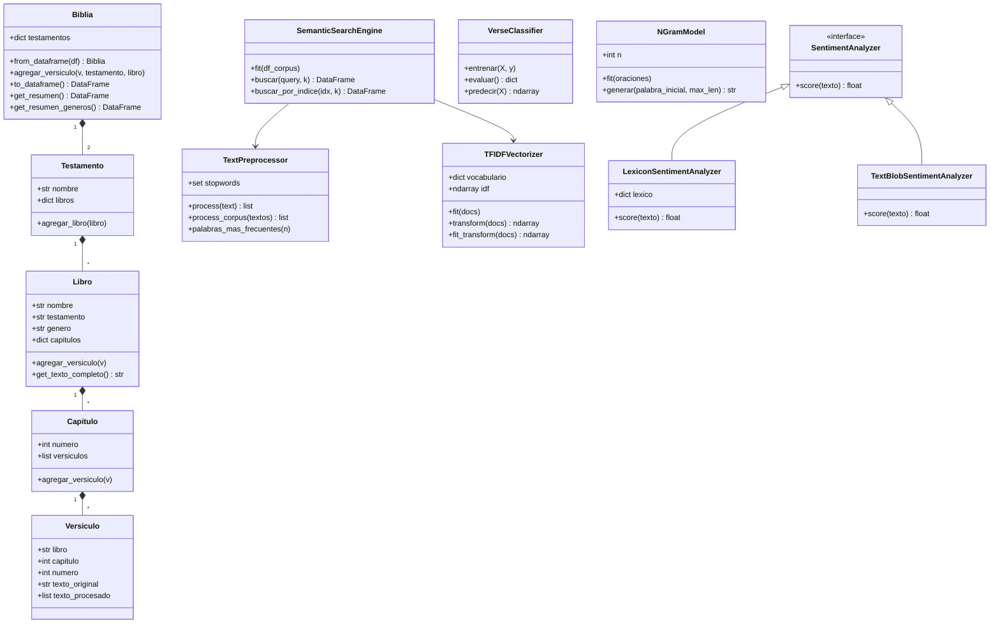

<h1 align="center"> Taller 02 - Programación Científica </h1>

<p align = center>
<a href = "https://www.ucn.cl"></a>
<a href = "https://eic.ucn.cl"> </a>
</p>

## Biblical Text Mining — Laboratorio 2

Este repositorio implementa un sistema de análisis computacional de texto sobre el
corpus bíblico, usando programación orientada a objetos. Incluye preprocesamiento,
**TF-IDF implementado desde cero**, **similitud del coseno propia**, motor de
búsqueda semántico, clasificador de versículos por libro, generador de texto con
modelos n-grama y análisis de sentimiento.

Los datos provienen de <https://www.kaggle.com/datasets/oswinrh/bible> en la versión
**ASV (American Standard Version)**: 31.103 versículos repartidos en 66 libros.

## Estructura del proyecto

```
Taller02-ProgCien/
├── data/                     # CSV del dataset + stopwords.json
│   ├── t_asv.csv
│   ├── key_english.csv
│   ├── key_genre_english.csv
│   └── stopwords.json
├── imgs/                     # figuras generadas por el pipeline
├── src/
│   ├── __init__.py
│   ├── models.py             # jerarquía Biblia → Testamento → Libro → Capítulo → Versículo
│   ├── data_loader.py        # carga y combina los 3 CSV de Kaggle
│   ├── preprocessing.py      # pipeline de limpieza y tokenización
│   ├── tfidf.py              # TF-IDF y similitud del coseno (propios)
│   ├── search_engine.py      # motor de búsqueda semántico
│   ├── classifier.py         # clasificador de versículos por libro
│   ├── ngram_model.py        # generador de texto (unigram/bigram/trigram/n-gram)
│   ├── sentiment.py          # análisis de sentimiento (léxico propio + TextBlob)
│   └── visualization.py      # gráficos del corpus
├── main.py                   # pipeline completo (secciones 3.1 a 3.7)
├── generate_report_data.py   # script auxiliar: genera figuras + results.json
├── requirements.txt
└── README.md
```

## Instalación

1. Clonar el repositorio:
``` bash
git clone https://github.com/Fifthtaschenmesser4/Taller02-ProgCien
cd Taller02-ProgCien
```
2. Instalar dependencias:
``` bash
pip install -q -r requirements.txt
```
3. Asegurarse de que los 3 CSV (`t_asv.csv`, `key_english.csv`, `key_genre_english.csv`)
   y `stopwords.json` estén dentro de `data/` (ya vienen en el repo).

## Ejecución

Pipeline completo (imprime resúmenes por consola y guarda las figuras en `imgs/`):
``` bash
python main.py
```

Generar los datos y figuras del informe (`results.json` + `imgs/`):
``` bash
python generate_report_data.py
```

> Nota: la matriz TF-IDF a nivel de versículo es densa (~31k × 12k). En equipos con
> poca RAM, las etapas a nivel de versículo (PCA, clasificador, búsqueda) se ilustran
> sobre una muestra estratificada por libro; las etapas agregadas usan el corpus
> completo. El código soporta el corpus completo sin cambios (probado en Colab).

## Diagrama de clases



## Integrantes
<table>
  <tr>
    <td align="center">
      <a href="#">
        <sub><b>Lucas Munizaga</b></sub>
      </a>
    </td>
    <td align="center">
      <a href="#">
        <sub><b>Sofía Bustos</b></sub>
      </a>
    </td>
    <td align="center">
      <a href="#">
        <sub><b>Nicolás Rivas</b></sub>
      </a>
    </td>
  </tr>
</table>
